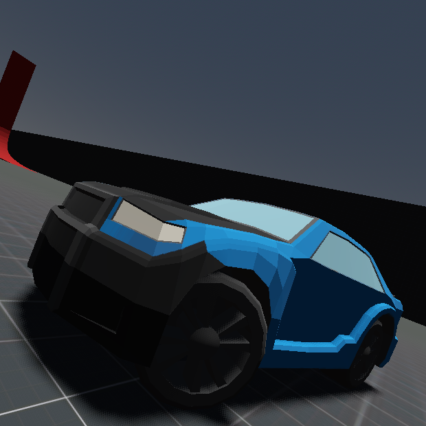

# Polyliner
</img>   

Millu30 Advanced Vehicle Controller. 
Supports Godot 4.3.

# Usage

This is an Advanced Vehicle controller created by Millu30 A.K.A Gidan 
 
Key Features: 
Controller support 
Manual and Automatic Gear system 
Vehicle engine and skid sound 
Skiding particles 
Customisable settings so that it can be reused on different vehicles 
In Deep documetation explaining what each line does in detail 
Debug info displaying Gears, Speed, Calculated RPM including AI cars 
Vehicle Lights sytem 
Vehicle Reset Button 
Easy to use / understand, simply plug and play 
Example map and vehicle provided for testing 
List of Controlls for both Keyboard and Controllers 
AI Based on node location and NavigationAgent3D for easy racing track setup 
Minimap with 2 render modes and rotation settings 
In game vehicle colour changing 
Custom node icons for easier reference 

Copyright 2025 Millu30 A.K.A Gidan
 
